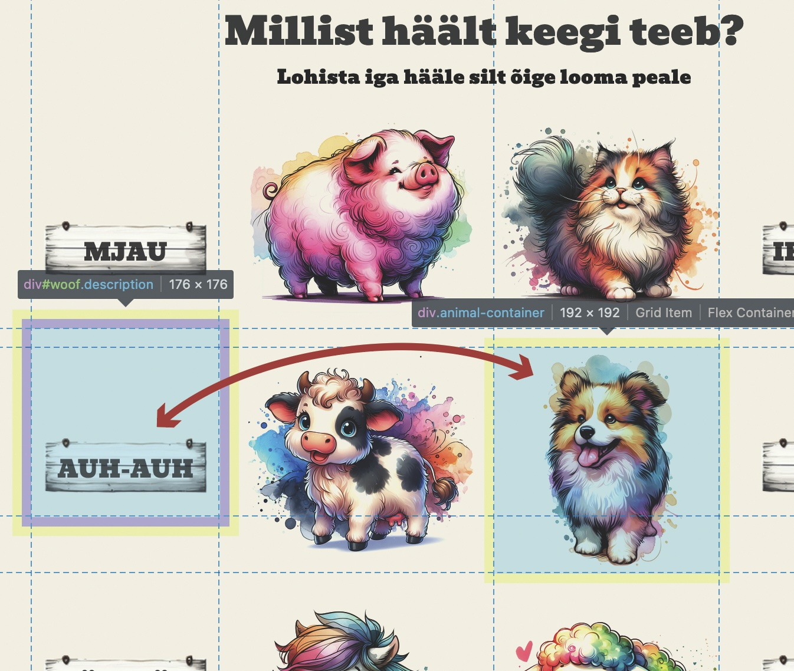
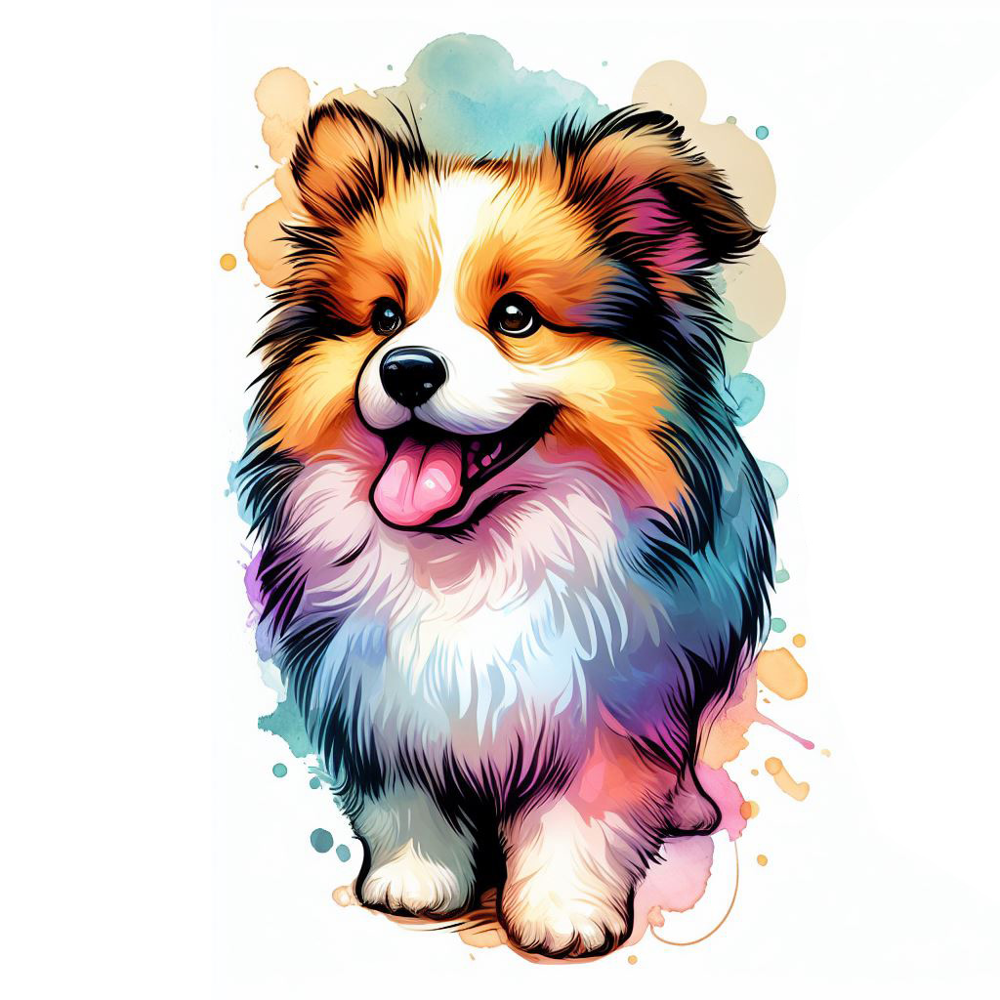

# Hääle sobivasse kohta lohistamise mäng javascripti õppimiseks

[Mängu töötav versioon](https://jubejuss.github.io/arva-looma-haal/)
## Kuidas see töötab?
### HTML
Siinses HTML-is on kolm peamist sektsiooni – päis, mängu ala ja kontrollnupud.  
Päises on lihtsalt pealkiri ja kirjeldus. Allosas on nupud, mille abil alglaadida mäng ning katkestada hääled ja keskel on mänguosa.  

Mänguosa koosneb külgedel asuvatest loomade häälesiltidest ja keskel asuvatest loomade piltidest, millistele neid häälesilte lohistatakse.  

Meil on kasutusel hääle ja looma paarid.  
Ühe looma kohta käib näiteks järgnev paar:  

```javascript
<!-- Kirjeldus, mis esindab koera häält -->
<div class="description" id="woof" data-animal="dog" draggable="true">
  Koera hääl
</div>

<!-- Koera pilt -->
<div class="animal-container">
  
</div>
```

Javascript hoolitseb selle eest, et kui lohistatav element kukutatakse sihtpunkti ja ühe elemendi `data-` atribuut vastab teise elemendi `id`le, siis käivitatakse funktsioonid, mis anavad meile tagasisidet. Siinse mängu puhul siis kiidetakse ja käivitatakse sobiva looma hääl või öeldakse, et ei sobi.  

`id` on HTML-is elemendi unikaalne identifikaator.  `data-` atribuudid võimaldavad HTML dokumentidesse lisada struktureeritud andmeid, mida saab hiljem JavaScriptiga kätte saada. 

Kogu mängu sisu seisneb selles, et me kasutame erinevaid päringuid, et teada saada, kus on mingi klassi või id-ga identifitseeritavad elemendid ning seejärel, vastavalt meie tegevusele käivitatakse kindlat tüüpi funktsioonid.

### Kood
```javascript
//seadistame elemendid nii, et esimest gruppi saab lohistada ja teisele saab need esimesed nö pähe kukutada – loeme sisse kogu DOM'i, siis pärime vastavate klassidega elemendid ja lisame neile vastava seadistuse.
document.addEventListener('DOMContentLoaded', function() {
    // Lisame lohistamise kuulajad kirjeldustele
    document.querySelectorAll('.description').forEach(item => {
        item.addEventListener('dragstart', dragStart);
        item.addEventListener('dragend', dragEnd);
    });

    // Lisame kukutamise kuulajad loomadele ja nende konteineritele
    document.querySelectorAll('.animal, .animal-container').forEach(container => {
        container.addEventListener('dragover', dragOver);
        container.addEventListener('drop', drop);
    });
});

// Funktsioon, mis käivitatakse lohistamise alguses. Me võtame id nimetuse lihtsa vormindamata tekstina.
function dragStart(event) {
    event.dataTransfer.setData("text/plain", event.target.id);  // Salvestame lohistatava elemendi ID
}

// Funktsioon, mis käivitatakse lohistamise lõpus
function dragEnd(event) {
    event.preventDefault();  // Vaikimisi lohistamise lõpetamise käitumine
}

// Funktsioon, mis käivitatakse elementi lohistades üle mõne potentsiaalse sihtelemendi
function dragOver(event) {
    event.preventDefault();  // Blokeerime vaikimisi käitumise, mis keelaks kukutamise
}

// Funktsioon, mis käivitatakse lohistatud elemendi kukutamisel sihtelemendile. Prevent default lubab kukutada.
function drop(event) {
    event.preventDefault();
    const descriptionId = event.dataTransfer.getData("text"); //saame kätte dragstart ajal salvestatud andmed
    const description = document.getElementById(descriptionId); //Küsime samanimelist ID-d HTML-ist

    // Määrame sihtelemendi, kontrollides, kas kukutati looma pildile või konteinerile
    // Me tahame teada, kas lohistatud hääl kukkus spetsiaalsesse konteinerisse, mis on ette nähtud loomadele (märgitud klassiga animal-container). 
    let targetElement = event.target;
    while (targetElement && !targetElement.classList.contains('animal-container')) {
        targetElement = targetElement.parentNode;  // Liigume üles DOM puus, kuni leiame õige konteineri
    }

    if (!targetElement) {
        return;  // Kui ei leitud sobivat sihtkohta, lõpetame funktsiooni
    }

    const animalImg = targetElement.querySelector('.animal');  // Leiame looma pildi konteinerist
    if (description.dataset.animal === animalImg.id) {
        // Küsime mõõdud ja asukoha:
        // getBoundingClientRect() on JavaScripti meetod, mis tagastab elemendi suuruse ja selle 
        // positsiooni suhtes viewport'ile (st brauseri aknale, milles lehekülg on avatud). See annab
        // meile objekti, mis sisaldab väärtused top, left, right, bottom, width ja height.
        // targetRect saab mõõtmed ja asukoha looma pildi elemendilt (animalImg), mida kasutaja just valis.
        // containerRect saab mõõtmed ja asukoha mänguala konteinerilt (game-area), 
        // mis on tõenäoliselt suurem ala, kus kõik loomad ja nende kirjeldused asuvad.
        const targetRect = animalImg.getBoundingClientRect();
        const containerRect = document.getElementById('game-area').getBoundingClientRect();
        description.style.position = 'absolute';
        description.style.left = (targetRect.left - containerRect.left) + 'px';
        description.style.top = (targetRect.top - containerRect.top) + 'px';
        playSound(animalImg.id);
        showModal('Tubli! Täitsa õige, sellist häält ta täpselt teebki!');
    } else {
        playSound('error');
        showModal('No päris nii ta ei tee, proovi natuke veel, küll sa oskad');
    }
}

// Funktsioon heli esitamiseks vastavalt looma ID-le
function playSound(animal) {
    if (currentAudio) {
        currentAudio.pause();
        currentAudio.currentTime = 0;  // Peata praegu mängiva heli, kui see on olemas
    }
    const soundMap = {
        'pig': 'sounds/pig.mp3',
        'dog': 'sounds/dog.mp3',
        'cow': 'sounds/cow.mp3',
        'horse': 'sounds/horse.mp3',
        'sheep': 'sounds/sheep.mp3',
        'cat': 'sounds/cat.mp3',
        'error': 'sounds/hungrysheep.mp3'  // Error heli on näiteks loomade segaheli
    };
    if (soundMap[animal]) {
        currentAudio = new Audio(soundMap[animal]);
        currentAudio.play();
    }
}

// Funktsioon modaalkasti näitamiseks koos sõnumiga – display:none asendatakse display:flex'ga
function showModal(message) {
    const modal = document.getElementById('modal');
    document.getElementById('modal-message').innerText = message;
    modal.style.display = 'flex';
}

// Funktsioon modaalkasti sulgemiseks
function closeModal() {
    document.getElementById('modal').style.display = 'none';
}

// Sisseehitatud funktsioon heli peatamiseks
function stopSound() {
    if (currentAudio) { // kontrollib, kas heli mängib
        currentAudio.pause(); // paneb seisma
        currentAudio.currentTime = 0; // kerib algusse
    }
}

// Funktsioon algse paigutuse taastamiseks
function resetPositions() {
    document.querySelectorAll('.description').forEach(item => {
        item.style.position = 'static';  // Taastame kirjelduste algse paigutuse – position:static
    });
}

// Globaalne muutuja heli haldamiseks, ei oma alguses mingit väärtust
let currentAudio = null;

// Klikk ükskõik kus aknas sulgeb modaalkasti
window.onclick = function(event) {
    if (event.target.classList.contains('modal')) {
        closeModal();
    }
}
```
Lisalugemist javascripti `drag` funktsioonidega tutvumiseks [leiab siit](https://developer.mozilla.org/en-US/docs/Web/API/HTMLElement/drag_event) ja [siit](https://developer.mozilla.org/en-US/play)  
Mõõtude hankimisega [seotud funktsioonid](https://developer.mozilla.org/en-US/docs/Web/API/Element/getBoundingClientRect)

### Mida miski koodijupp teeb?
`document.addEventListener('DOMContentLoaded', function() { ... });` - See käivitab funktsiooni, kui HTML-dokument on täielikult laaditud ja parsitud.  
`document.querySelectorAll('.description').forEach(item => { ... });` - See valib kõik elemendid, millel on klass "description", ja rakendab igaühele sündmuskuulajaid.  
`item.addEventListener('dragstart', dragStart);` - See lisab "dragstart" sündmuskuulaja iga "description" elemendile, mis käivitub, kui elementi hakatakse lohistama.  
`item.addEventListener('dragend', dragEnd);` - See lisab "dragend" sündmuskuulaja, mis käivitub, kui lohistamise lõpetatakse.  
`function dragStart(event) { ... }` - See funktsioon käivitatakse, kui lohistamine algab. See salvestab lohistatava elemendi ID, et hiljem sellele viidata.  
`function dragEnd(event) { ... }` - See funktsioon käivitatakse, kui lohistamine lõpeb. See takistab vaikimisi lohistamise lõpetamise käitumist.  
`function dragOver(event) { ... }` - See funktsioon käivitatakse, kui lohistatud element liigub üle sihtelemendi. See takistab vaikimisi käitumist, mis ei luba elementi kukutada.  
`function drop(event) { ... }` - See funktsioon käivitatakse, kui lohistatud element kukutatakse sihtelemendile. See määrab sihtelemendi, kontrollib sobivust ning kui element kukutati õigesse kohta, siis kuvab modaalkasti vastava sõnumi.  
`function playSound(animal) { ... }` - See funktsioon mängib vastavalt looma ID-le helifaili. See peatab ka praeguse mängiva heli, kui see on olemas.  
`function showModal(message) { ... }` - See funktsioon kuvab modaalkasti koos antud sõnumiga.  
`function closeModal() { ... }` - See funktsioon sulgeb modaalkasti.  
`function stopSound() { ... }` - See funktsioon peatab mängiva heli.  
`function resetPositions() { ... }` - See funktsioon taastab elementide algse paigutuse.  
`let currentAudio = null;` - See loob globaalse muutuja heli haldamiseks.  
`window.onclick = function(event) { ... }` - See funktsioon sulgeb modaalkasti, kui klikitakse ükskõik kus aknas, välja arvatud modaalkastis.  
